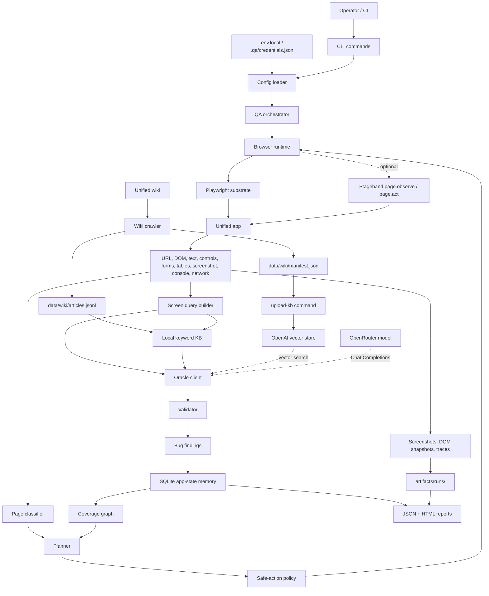
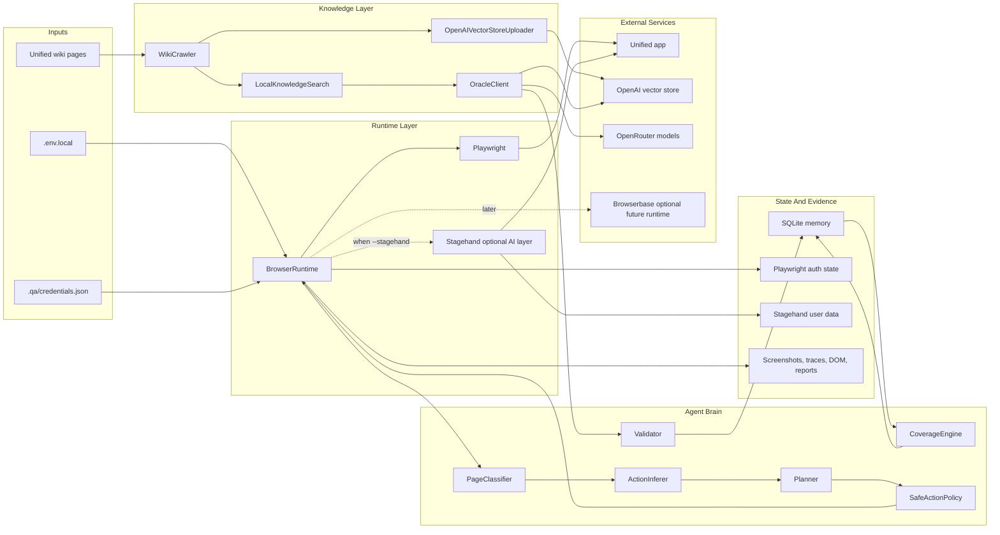

# Unified Production QA Agent

An automated QA agent for Unified applications. It logs into the app, discovers routes and workflows, captures evidence, validates screens against the Unified wiki, classifies bugs, and resumes from persisted coverage state after interruptions.

The production loop is:

```text
observe page -> classify page -> retrieve wiki context -> infer actions -> choose safe action -> execute -> validate -> record evidence -> update coverage -> repeat
```

The agent can run in two modes:

- **Fallback mode:** Playwright-only runtime, local keyword retrieval over `data/wiki/articles.jsonl`, screenshots, traces, console/network capture, reports, route graph memory, and safety policies. No `OPENAI_API_KEY` is required.
- **AI mode:** everything in fallback mode plus OpenAI vector-store search for wiki retrieval, OpenRouter model-backed oracle validation, and optional Stagehand AI browser observation/actions routed through OpenRouter.

## Data Flow



## Architecture



## Why OpenAI And OpenRouter Are Used

`OPENAI_API_KEY` is used only for knowledge retrieval:

- **Vector-store upload:** `upload-kb` creates or updates an OpenAI vector store from crawled wiki records.
- **Vector-store search:** `run` queries that vector store for relevant wiki chunks per screen.

`OPENROUTER_API_KEY` is used for reasoning/model work:

- **Model-backed oracle:** the oracle sends local + OpenAI-vector retrieved wiki context to OpenRouter Chat Completions and asks for structured QA judgments.
- **Stagehand AI browser layer:** when `--stagehand` is enabled, Stagehand can route model calls through OpenRouter's OpenAI-compatible API.
- **Budget control:** `OPENROUTER_MAX_RUN_COST_USD` caps estimated oracle spend for a run.

Without `OPENAI_API_KEY`, the agent still runs with local keyword retrieval. Without `OPENROUTER_API_KEY`, the agent still runs with heuristic oracle validation.

## Repository Layout

```text
src/cli.ts                         CLI entrypoint
src/orchestrator/qaAgent.ts         main observe/retrieve/execute/validate loop
src/runtime/browserRuntime.ts       Playwright + Stagehand runtime
src/wiki/crawler.ts                 wiki crawl and normalization
src/knowledge/*                     local search, OpenAI vector upload, oracle client
src/planner/*                       page classification, action inference, planning
src/policy/safeActionPolicy.ts      approval gates and mutation rules
src/coverage/coverageEngine.ts      visited/unvisited route graph
src/memory/sqliteMemory.ts          resumable app-state memory
src/validator/validator.ts          bug detection and severity classification
src/report/reporter.ts              JSON/HTML report generation
test/*.test.ts                      unit coverage for core behavior
```

## Setup

Use Node 24 or newer.

```bash
npm install
npx playwright install chromium
npm run build
```

Create `.env.local` for local secrets. This file is ignored by git.

```bash
cp .env.example .env.local
```

Minimum local credentials:

```bash
UNIFIED_QA_BASE_URL=https://sso.unified-apps.com/login
UNIFIED_QA_WIKI_URL=https://wiki.unified-apps.com/
UNIFIED_QA_EMAIL=newdemoadmin@demo.demo
UNIFIED_QA_PASSWORD=iloveunified
UNIFIED_QA_TENANT=demo
UNIFIED_QA_ROLE=admin
```

## Environment Variables

| Variable | Required | Default | Purpose |
| --- | --- | --- | --- |
| `UNIFIED_QA_BASE_URL` | Yes | none | Login/start URL for the app under test. |
| `UNIFIED_QA_WIKI_URL` | No | `https://wiki.unified-apps.com/` | Root URL for wiki ingestion. |
| `UNIFIED_QA_EMAIL` | Yes, unless using `QA_CREDENTIALS_FILE` | none | Login email for the selected tenant/profile. |
| `UNIFIED_QA_PASSWORD` | Yes, unless using `QA_CREDENTIALS_FILE` | none | Login password for the selected tenant/profile. |
| `UNIFIED_QA_TENANT` | No | `demo` | Tenant label used for credentials, storage state, and reports. |
| `UNIFIED_QA_ROLE` | No | `admin` | Role label used for credentials, storage state, and reports. |
| `QA_CREDENTIALS_FILE` | No | `.qa/credentials.json` | Optional multi-profile credential file. |
| `QA_WIKI_JSONL` | No | `data/wiki/articles.jsonl` | Local wiki records used by fallback keyword search. |
| `QA_STORAGE_PATH` | No | `.qa/qa-agent.sqlite` | SQLite memory path. |
| `QA_ARTIFACT_DIR` | No | `artifacts/runs` | Screenshots, traces, DOM snapshots, and reports. |
| `QA_SAFETY_STEP_LIMIT` | No | `1000` | Safety ceiling for one run. |
| `OPENAI_API_KEY` | Vector mode only | none | Enables OpenAI vector store upload and vector-store search. Not used for model reasoning. |
| `OPENAI_VECTOR_STORE_ID` | Vector mode only | none | Vector store containing uploaded wiki records. |
| `OPENAI_VECTOR_SEARCH_MAX_RESULTS` | No | `8` | Max vector-search chunks per screen. |
| `OPENROUTER_API_KEY` | Model mode only | none | Enables OpenRouter model-backed oracle validation and optional Stagehand model calls. |
| `OPENROUTER_BASE_URL` | No | `https://openrouter.ai/api/v1` | OpenRouter OpenAI-compatible API base URL. |
| `OPENROUTER_ORACLE_ROUTING` | No | `auto` | `auto`, `light`, `heavy`, or an explicit OpenRouter model id. |
| `OPENROUTER_ORACLE_LIGHT_MODEL` | No | `openai/gpt-5.1-chat` | Lower-cost oracle model for routine screens. |
| `OPENROUTER_ORACLE_HEAVY_MODEL` | No | `openai/gpt-5.5` | Heavier oracle model for complex screens. |
| `OPENROUTER_ORACLE_MAX_TOKENS` | No | `1200` | Max oracle completion tokens per call. |
| `OPENROUTER_MAX_RUN_COST_USD` | No | `100` | Estimated model-spend guard for one process. |
| `QA_ORACLE_MODEL` | No | `openai/gpt-5.1-chat` | Fallback oracle model id when routing selects light/manual mode. |
| `STAGEHAND_ENV` | No | `LOCAL` | `LOCAL` or `BROWSERBASE`. |
| `STAGEHAND_MODEL_NAME` | No | `openai/openai/gpt-5.1-chat` with OpenRouter | Model used by Stagehand observe/act calls. The doubled provider prefix lets Stagehand send `openai/gpt-5.1-chat` to OpenRouter. |
| `BROWSERBASE_API_KEY` | Browserbase mode only | none | Browserbase API key for hosted browser sessions. |
| `BROWSERBASE_PROJECT_ID` | Browserbase mode only | none | Browserbase project ID. |

## Multi-Tenant Credentials

For a single account, `.env.local` is enough. For multiple tenants or roles, use `.qa/credentials.json`:

```json
{
  "profiles": [
    {
      "tenant": "demo",
      "role": "admin",
      "email": "newdemoadmin@demo.demo",
      "password": "iloveunified"
    },
    {
      "tenant": "demo",
      "role": "viewer",
      "email": "viewer@example.com",
      "password": "set-locally"
    }
  ]
}
```

`tenant` and `role` are local profile labels. They let the agent choose credentials, isolate auth state, and report which permission profile found a bug. If you only have one email/password, keep `tenant=demo` and `role=admin`.

Auth state is stored outside git:

- Playwright-only state: `.qa/auth/<tenant>-<role>.json`
- Stagehand local browser profile: `.qa/stagehand-user-data/<tenant>-<role>/`

## Wiki Ingestion

Crawl the Unified wiki into markdown, JSONL, and a manifest:

```bash
npm run qa:ingest
```

Useful options:

```bash
npx tsx src/cli.ts ingest-wiki --url https://wiki.unified-apps.com/ --out data/wiki
npx tsx src/cli.ts ingest-wiki --limit 50 --max-depth 4
```

The crawler stores normalized records with URL, title, headings, body, extracted workflow-like lines, and content hashes. The local JSONL file powers fallback retrieval.

## OpenAI Vector Store

After crawling the wiki, upload it to OpenAI:

```bash
OPENAI_API_KEY=sk-... npx tsx src/cli.ts upload-kb \
  --manifest data/wiki/manifest.json \
  --vector-store-name unified-wiki
```

For large wikis, use the consolidated upload mode. This uploads one searchable markdown bundle instead of hundreds of individual files:

```bash
npx tsx src/cli.ts upload-kb \
  --manifest data/wiki/manifest.json \
  --vector-store-name unified-wiki \
  --consolidated
```

The command prints a vector store id like `vs_...`. Add it to `.env.local`:

```bash
OPENAI_VECTOR_STORE_ID=vs_...
```

You can update an existing vector store:

```bash
npx tsx src/cli.ts upload-kb \
  --manifest data/wiki/manifest.json \
  --vector-store-id "$OPENAI_VECTOR_STORE_ID"
```

## Running The Agent

Fallback mode, no OpenAI key:

```bash
npm run qa:run
```

Run with a visible browser:

```bash
npm run qa:run -- --headed
```

Run with OpenAI vector retrieval and OpenRouter model-backed oracle:

```bash
npm run qa:run -- --vector-store-id "$OPENAI_VECTOR_STORE_ID"
```

Run with OpenAI vector retrieval, OpenRouter oracle, and Stagehand routed through OpenRouter:

```bash
npm run qa:run -- --stagehand --vector-store-id "$OPENAI_VECTOR_STORE_ID"
```

Resume a run:

```bash
npx tsx src/cli.ts run --resume <runId>
```

Generate a report again from persisted evidence:

```bash
npm run qa:report -- --run-id <runId>
```

Build output can also be run directly:

```bash
npm run build
node dist/src/cli.js run --base-url https://sso.unified-apps.com/login
```

## Agent Behavior

Each loop does the following:

1. Captures the current URL, route key, visible text, controls, forms, tables, breadcrumbs, screenshot, DOM snapshot, console messages, and network failures.
2. Classifies the page as auth, dashboard, list/table, detail, form, settings, modal, wizard, report, error, empty, or unknown.
3. Retrieves relevant local wiki chunks and, when configured, asks OpenAI vector-store search for additional evidence.
4. Infers candidate actions such as navigation, search, filter, open detail, create sandbox record, edit sandbox record, export, cancel/back, and logout.
5. Applies safe-action policy before execution.
6. Executes through Playwright locators first. Stagehand `page.act()` is used only as a bounded fallback when `--stagehand` is enabled.
7. Validates transitions, visible success/error text, persistence hints, console/runtime errors, failed requests, dead-end states, and wiki/product mismatches using OpenRouter when configured.
8. Records evidence and updates the coverage graph.

Completion means the route/action frontier is exhausted, or every remaining item is blocked/skipped with evidence.

## Safety Policy

Default behavior is conservative:

- Navigation, search, filtering, opening details, cancel/back, and read-only exploration are allowed.
- Sandbox mutations are allowed only for records tagged with `qa_<runId>`.
- Generic submit/edit/import actions require approval unless the agent can prove the target belongs to the same run.
- Destructive actions require approval unless cleaning up a record created by the same run.
- Logout is skipped during exploratory runs so the agent does not prematurely end coverage.
- Invites, external notifications, billing/subscription changes, and tenant-wide settings are denied or approval-gated.

Use `--allow-destructive` only in a prepared sandbox tenant.

## Bug Classification

Findings are grouped into:

- Functional bug
- Workflow mismatch
- Wiki/product mismatch
- Copy/text issue
- Layout/display issue
- Accessibility issue
- Validation issue
- Broken navigation
- Auth/permission issue
- Console/runtime error
- Network/API failure
- Data persistence issue
- Flaky/timeout issue

Severity rules:

- `P0`: blocks login, tenant access, or critical workflows.
- `P1`: breaks core create/edit/view/reporting flows or risks data loss.
- `P2`: incorrect behavior, misleading copy, broken secondary flows, or visible UI defects.
- `P3`: polish, consistency, minor copy, or low-risk accessibility issues.

Each finding includes route, tenant/profile, steps, expected result, actual result, screenshot, trace path, console/network evidence, and wiki citations when available.

## Artifacts And Memory

Run evidence is written to:

```text
artifacts/runs/<runId>/
```

Typical contents:

- `screenshots/*.png`
- `traces/*.zip`
- `dom/*.html`
- `report.json`
- `report.html`

SQLite memory defaults to:

```text
.qa/qa-agent.sqlite
```

It stores routes, transitions, observations, attempted actions, blocked/skipped actions, findings, evidence, created records, and run status. This is what makes runs resumable.

## CI

The included GitHub Actions workflow installs dependencies, installs Playwright Chromium, builds, and runs tests. To run live QA in CI, add repository secrets for the Unified profile and, optionally, OpenAI/OpenRouter:

- `UNIFIED_QA_EMAIL`
- `UNIFIED_QA_PASSWORD`
- `OPENAI_API_KEY`
- `OPENAI_VECTOR_STORE_ID`
- `OPENROUTER_API_KEY`

Keep live QA jobs pointed at a sandbox tenant.

## Development Checks

```bash
npm run build
npm test
```

The current test suite covers local KB retrieval, page classification, route key stability, scoped URL filtering, safe-action policy decisions, and SQLite route memory.

## Troubleshooting

`Run incomplete because max steps stopped first`
: Increase `QA_SAFETY_STEP_LIMIT`, pass `--max-steps`, or resume the run. The limit is a safety guard, not a coverage target.

`Stagehand initialization failed; falling back to Playwright only`
: Check `OPENROUTER_API_KEY`, `STAGEHAND_MODEL_NAME`, `OPENROUTER_BASE_URL`, and `STAGEHAND_ENV`. Fallback mode still runs.

`No wiki context was available`
: Run `npm run qa:ingest` and confirm `data/wiki/articles.jsonl` exists, or set `QA_WIKI_JSONL`.

`Oracle is heuristic only`
: Set `OPENROUTER_API_KEY` for model-backed validation. Set `OPENAI_API_KEY` and `OPENAI_VECTOR_STORE_ID` for vector-store retrieval.

`Login keeps looping`
: Remove stale auth state under `.qa/auth/` or `.qa/stagehand-user-data/`, then rerun.

`A run escaped to unrelated links`
: The runtime scopes discovered links to Unified-owned app domains and excludes the wiki domain during app QA. Check `src/utils/route.ts` if a new Unified app domain needs to be allowed.

## Notes On Stagehand

The top-level orchestrator remains our own planner/validator/coverage engine. Stagehand is deliberately limited to:

- `page.observe()` for unfamiliar screens.
- `page.act()` only for the selected action when deterministic Playwright locators are not available.

This keeps the QA product deterministic, resumable, and reportable while still allowing AI browser help where it has the most value.
